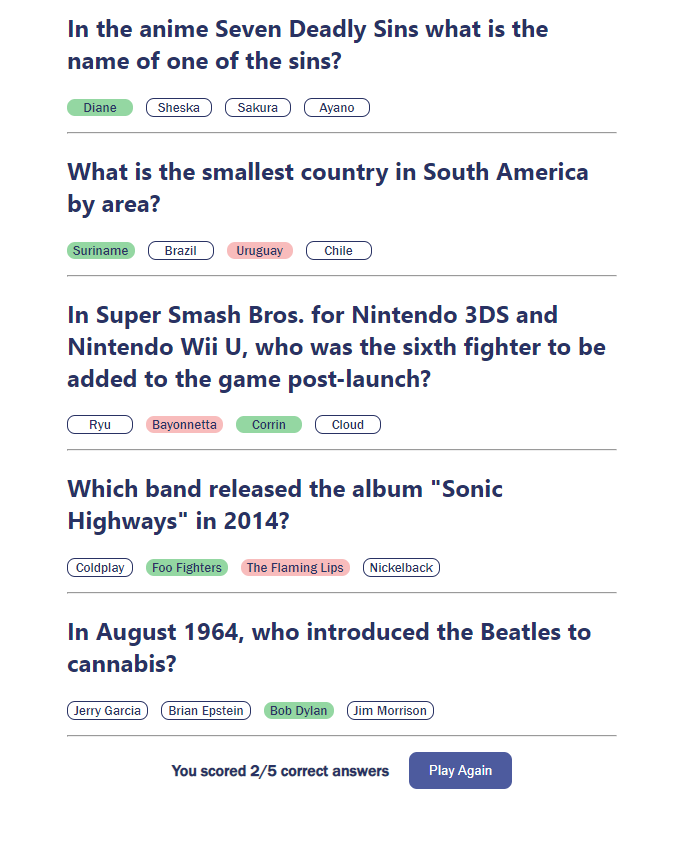

# Scrimba - Quizzical trivia game

This is a solution to the [Quizzical final project of Scrimba's Learn React for free course](https://scrimba.com/learn/learnreact/react-section-4-solo-project-co24f49bea8aace7c174082c8).

## Table of contents

- [Overview](#overview)
  - [The challenge](#the-challenge)
  - [Screenshot](#screenshot)
- [My process](#my-process)
  - [Built with](#built-with)
  - [What I learned](#what-i-learned)
  - [Continued development](#continued-development)
- [Author](#author)
- [Acknowledgments](#acknowledgments)


## Overview

### The challenge

Users should be able to:

- Complete a trivia game that returns their score out of 5. 
- Players can view the state of their selections, and can see what answers they got right and wrong when check answers is selected. 

### Screenshot



## My process

### Built with

- HTML5
- CSS
- Flexbox
- [React](https://reactjs.org/) - JS library
- [uuidv4](https://www.npmjs.com/package/uuidv4) - Node package


### What I learned

I think one of the major hurdles in doing this project was understanding how to fetch the data and map it out. As the data is fetched asynchronosly the temptation was to set the fetched data to state and then manipulate it.
This would lead to errors as my transformations were resulting in undefined as the fetched data was not in state before I attempted to transform it. Therefore I fetched and mapped my data using:

```js

React.useEffect(() => {
        console.log("logged")
        fetch("https://opentdb.com/api.php?amount=5&type=multiple")
            .then(res => res.json())
            .then(data => {
                // console.log(data)
                var remapped_data = data.results.map( (result) => {
                   var answers = result.incorrect_answers;
                   answers.push( result.correct_answer );
                   let shuffledAnswers = shuffle(answers)
                   let decodedAnswers = shuffledAnswers.map((x) => {
                                        return htmlDecode(x)
                                        })
               
                   return { "question": htmlDecode(result.question), 
                            "answers": decodedAnswers.map((x) => {
                                        return {
                                            "answer": x,
                                            "answerId": nanoid()
                                        }
                                    }), 
                            "correct_answer": htmlDecode(result.correct_answer),
                            "selectedAnswer": "",
                            "id": nanoid() 
                            }
                } )
                                
                setQuestions( remapped_data )
                                
            })
    }, [restartGame]) 

```

I also had to parse the data fetched that came in HTML format. This function I googled really came in handy:

```js
 function htmlDecode(input) {
        let doc = new DOMParser().parseFromString(input, "text/html");
        return doc.documentElement.textContent;
    } 
```


### Continued development

This project could probably use some sort of background or imagery to really make it pop. 
It could make use of animations when checking answers.
A win state such as confetti falling from the confetti npm package could be used. 

## Author

- Website - [Cecil Mahumane](https://github.com/cecmahumane)


## Acknowledgments

I would like to give special thanks to Frank Davies for providing code reviews and key insights that helped me develop this project. I would also like to thank Bob Ziroll for teaching a great intro to React course. 

